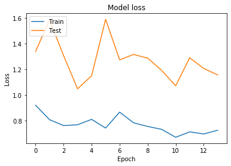
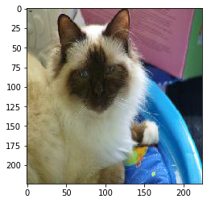

# Convolutional

## [Введение](../README.md)

Вся проведенная работа содержится в Jupiter-ноутбуке [main.ipynb](main.ipynb).
Файл включает в себя:
* Подготовку тестовых, тренировочных, валидационных данных.
* Создание моделей
* Обучение моделей
* Визуализацию каждого шага
* Тестирование модели с использованием тестовых данных

Мы использовали Data Augmentation:

1. Random rotation
2. Horizontal flip
3. Width/height shifts
4. Zoom range
5. Brightness changing (70-130%)

## Теория

В наших моделях было использовано:

- Функция активации Relu на скрытых слоях
**relu(x) = max(0,x)**
- Функция активации на выходном слое - SoftMax

- Слой BatchNormalization. Этот слой нормализует данные:
Сводит мат.ожидание к нулю и дисперсию к единице.
[Wiki BatchNormalization](https://en.wikipedia.org/wiki/Batch_normalization)

- Слой Dropout для случайного отключения n нейронов, при ***n=70%***

- GlobalAveragePooling2D для усреднения значения по каналам.

- Оптимизатор Adam, adaptive momentum. ***Used learning rate = 1e-2***

- Инициализация начальных весов с помощью Xavier.

## Конфигурации моделей

В данной работе были проведены эксперементы со следующими моделями

1. ***Сверточная модель с тремя скрытыми слоями***

|Layer (type)    |Output Shape| Param # |
|-----|-----|-----|
| Conv2D                        | (112, 112, 64)      | 9472      |
| Relu    | (112, 112, 64)      | 0         |
| MaxPooling2D | (56, 56, 64)        | 0         |
| Conv2D            | (56, 56, 128)       | 73856     |
| Relu    | (56, 56, 128)       | 0         |
| Conv2D            | (56, 56, 128)       | 147584    |
| Relu    | (56, 56, 128)       | 0         |
| MaxPooling2D | (28, 28, 128)       | 0         |
| Flatten          | (100352)            | 0         |
| Dense              | (256)               | 25690368  |
| Dense              | (37)                | 9509      |

Total params: 25,930,789

Trainable params: 25,930,789

Non-trainable params: 0

2. ***Сверточная модель с 3 скрытыми с использованием Batch Normalization + Global Pooling***

|Layer (type)    |Output Shape| Param # |
|-----|-----|-----| 
| Conv2D           | (112, 112, 64)   | 9472      |
| batch_normalization | (112, 112, 64)   | 256       |
| Relu  | (112, 112, 64)   | 0         |
| max_pooling | (56, 56, 64)     | 0         |
| Conv2D           | (56, 56, 128)    | 73856     |
| batch_normalization | (56, 56, 128)    | 512       |
| Relu   | (56, 56, 128)    | 0         |
| Conv2D           | (56, 56, 128)    | 147584    |
| batch_normalization  | (56, 56, 128)    | 512       |
| Relu   | (56, 56, 128)    | 0         |
| max_pooling | (28, 28, 128)    | 0         |
| Conv2D           | (28, 28, 256)    | 295168    |
| batch_normalization| (28, 28, 256)    | 1024      |
| Relu   | (28, 28, 256)    | 0         |
| Conv2D           | (28, 28, 256)    | 590080    |
| batch_normalization  | (28, 28, 256)    | 1024      |
| Relu   | (28, 28, 256)    | 0         |
| max_pooling | (14, 14, 256)    | 0         |
| global_average_pooling  | (256)            | 0         |
| Dense             | (37)             | 9509      |

Total params: 1,128,997

Trainable params: 1,127,333

Non-trainable params: 1,664

Переобучение снизилось. Точность на тренировочной выборке возросла до 0,68. Сходится модель намного быстрее благодаря слоям батч нормализации. Попробуем добавить дропаут перед слоем классификации, чтобы еще снизить переобучение.

3. ***Сверточная модель с 3 скрытыми с использованием Batch Normalization + Global Pooling***

|Layer (type)    |Output Shape| Param # |
|-----|-----|-----| 
| Conv2D           | (112, 112, 64)   | 9472      |
| batch_normalization | (112, 112, 64)   | 256       |
| Relu  | (112, 112, 64)   | 0         |
| max_pooling | (56, 56, 64)     | 0         |
| Conv2D           | (56, 56, 128)    | 73856     |
| batch_normalization | (56, 56, 128)    | 512       |
| Relu   | (56, 56, 128)    | 0         |
| Conv2D           | (56, 56, 128)    | 147584    |
| batch_normalization  | (56, 56, 128)    | 512       |
| Relu   | (56, 56, 128)    | 0         |
| max_pooling | (28, 28, 128)    | 0         |
| Conv2D           | (28, 28, 256)    | 295168    |
| batch_normalization| (28, 28, 256)    | 1024      |
| Relu   | (28, 28, 256)    | 0         |
| Conv2D           | (28, 28, 256)    | 590080    |
| batch_normalization  | (28, 28, 256)    | 1024      |
| Relu   | (28, 28, 256)    | 0         |
| max_pooling | (14, 14, 256)    | 0         |
| global_average_pooling  | (256)            | 0         |
| dropout  | (256)            | 0         |
| Dense             | (37)             | 9509      |

Total params: 1,128,997

Trainable params: 1,127,333

Non-trainable params: 1,664

Большой процент дропаута сильно помог с переубучением! Сохраним на состояние модели для последующих тестов.

#### Попробуем применить аугментацию наших изображений
- случайный поворот на 10 градусов
- случайное зуммирование на 10%
- случайное изменение яркости в диапозоне [0.7, 1.3]
- случайное горизонтальное отображение
Это должно привести к более стабильным результатам. Используем предыдущую архитектуру сети, т.к. она дала самые лучшие результаты.

Как видно из графика сильно это не помогло. Предположение: уменьшить learning rate, возможно модель зависла на плато и сойдется еще чуть-чуть. Используем lr=0.0003, как советовал ***Andrej Karpathy*** в своем [твиттере](https://twitter.com/karpathy/status/801621764144971776) =D

***+12% точности*** на валидационной выборке! Неплохо. Возможно еще раз уменьшить lr... но по 2 минуты на эпоху слишком долго... Остановимся на этом и сохраним модель.

## Тестирование моделей

Для тестирования использовались следующие модели:

- С использованием аугментации данных

test loss: 1.0759704853609156

test accuracy: 0.6677740869728037

- Без использования аугментации данных

test loss: 1.4011994063854218

test accuracy: 0.603125

### Пример

Запустим обе модели и попробуем определить породу для данного изображения 

Expected category : Birman

|Category|without data aug|with data aug|
|--|--|--|
|Birman| 0.25984254 | 0.6058526 |
|Siamese| 0.7225431 | 0.35187736|
|Ragdoll| 0.014338933 | 0.042145062|
