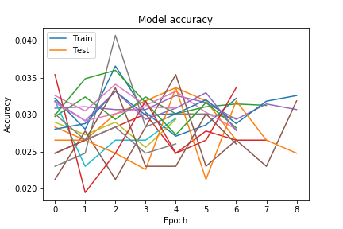

## Цель
Цель настоящей работы состоит в том, чтобы получить базовые навыки работы с одной из библиотек глубокого обучения (Caffe, Torch, TensorFlow, MXNet или какая-либо другая библиотека на выбор студента) на примере полностью связанных нейронных сетей. 
## Задачи
Выполнение практической работы предполагает решение следующих задач: 
Выбор библиотеки для выполнения практических работ курса. 
Установка выбранной библиотеки на кластере (параметры аутентификации и инструкция по работе с кластером выложена в отдельной задаче в системе redmine). 
Проверка корректности установки библиотеки. Разработка и запуск тестового примера сети, соответствующей логистической регрессии, для решения задачи классификации рукописных цифр набора данных MNIST (пример разобран в лекционных материалах). 
Выбор практической задачи компьютерного зрения для выполнения практических работ. 
Разработка программ/скриптов для подготовки тренировочных и тестовых данных в формате, который обрабатывается выбранной библиотекой. 
Разработка нескольких архитектур полностью связанных нейронных сетей (варьируются количество слоев и виды функций активации на каждом слое) в формате, который принимается выбранной библиотекой. 
Обучение разработанных глубоких моделей. 
Тестирование обученных глубоких моделей. 
Публикация разработанных программ/скриптов в репозитории на GitHub. 
Подготовка отчета, содержащего минимальный объем информации по каждому этапу выполнения работы. 
## Решаемая задача
Была выбрана задача классификации животных. Количество классов - 37. Датасет: 
#### https://www.kaggle.com/tanlikesmath/the-oxfordiiit-pet-dataset

Архив обучающего набора имеет следующую структуру: директория с изображениями, имена которых представляют собой конкатенацию названия класса и порядковый номер изображения в классе - Class_<Number>.jpg. Таким образом, был написан python-скрипт, создания csv файла с двумя столбцами: наименование класса, а также относительный путь до изображения. На каждый класс приблизительно 200 изображений.

Формат изображения:

Каждое изображение содержит животное
Изображения хранятся в формате JPEG
Размеры изображения варьируются от 137x103 до 3264x2448 пикселей
Изображения необязательно имеют квадратную форму
Животное не обязательно находится в центре изображения

В процессе выполнения лабораторной работы было выполнено множество различных комбинаций предобработки изображений. Ниже приведена таблица используемых параметров класса ImageDataGenerator.

| Параметр        | 1     | 2     | 3     | 4     | 5     | 6     |
|-----------------|-------|-------|-------|-------|-------|-------|
| rescale         | 1/255 | 1/255 | 1/255 | 1/255 | 1/255 | 1/255 |
| rotation range  | 2     | 1     | 4     | 0.5   | 2     | 1     |
| width shift     | 1     | 2     | 5     | 0.3   | 0.1   | -     |
| heigth shift    | -     | 1     | 3     | 2     | 1     | 1     |
| zoom range      | 2     | 0.05  | 0.1   | 0.5   | 0.7   | 0.5   |
| horizontal flip | -     | -     | true  | true  | true  | -     |
| vertical flip   | true  | -     | -     | -     | -     | true  |

## Примеры изображений

## Выбор библиотеки
Для выполнения лабораторных работ была выбрана библиотека Keras для языка программирования Python. 

На этапе проверки корректности установки библиотеки выполнена разработка и запуск тестового примера сети для решения задачи классификации рукописных цифр набора данных MNIST. Достигнута точность 0.89.
## Метрика качества решения
В качестве метрики точности решения используется отношение правильно классифицированных знаков ко всем знакам в тестовой выборке:
![Metric] (resources/accuracy.png)
## Тренировочные и тестовые наборы данных
В качестве тренировочной выборки используем 5345 изображений различных животных.
В качестве тестовой выборки используем 629 изображений животных.
## Конфигурации нейронных сетей
В данной работе были рассмотрены шесть конфигураций полностью связанных нейронных сетей с 3-мя скрытыми слоями. 

Активационная функция на слоях выбирается из следующих:
![Activation] (resources/activation1.png)
![Selu] (resources/activation2.png)
Для обучения был использован модифицированный метод градиентного спуска. Adam — adaptive moment estimation, оптимизационный алгоритм. Он сочетает в себе и идею накопления движения и идею более слабого обновления весов для типичных признаков. Его реализация имеется в библиотеке Keras. Для начальной инициализации весов был использован Xavier Initialization 
# Конфигурации
## 1-слойные
### ReLu
### Количество нейронов: 32

### Количество нейронов:64

### Количество нейронов: 256

### SeLu
### Количество нейронов: 32

### Количество нейронов:64

### Количество нейронов: 256

### Tanh
### Количество нейронов: 32

### Количество нейронов:64

### Количество нейронов: 256

## 2-слойные
### ReLu
### Количество нейронов: 512-256

### Количество нейронов: 1024-512

### SeLu
### Количество нейронов: 512-256

### Количество нейронов: 1024-512

### Tanh
### Количество нейронов: 512-256

### Количество нейронов: 1024-512

## Разработанные программы/скрипты
Был разработан python-скрипт create_csv.py, обрабатывающий массив изображений и создающий csv-файл с двумя столбцами: category и path. Первый столбец содержит информацию вида class_name, второй столбец содержит относительный путь до изображения. Затем был разработан .ipynb-скрипт реализующий обучение нейронной сети. Для генерации тренировочных и валидационных данных был использован упомянутый выше csv-файл. Для предобработки изображений из нашей тренировочной выборки использовался класс ImageDataGenerator, определяющий конфигурацию подготовки данных. В процессе обучения нейронной сети были испробованы следующие параметры класса: rescale, rotation range, horizontal and vertical flip, width and height shift. В свою очередь предобработка валидационных данных заключалась в применении rescale. Далее проходит обучение двух наших моделей с применением различных функций активации, таких как: гиперболический тангенс, ReLu и SeLu. Первая модель является однослойной, вторая - двухслойной. 
## Результаты экспериментов
Параметры обучения:
1. Функция ошибки: 'categorical_crossentropy', 
2. Оптимизационный алгоритм: 'adam' - https://keras.io/optimizers/, 
3. batch_size: 64,
4. Количество эпох: 100 (использовался callback EarlyStopping, patience = 4)
5. Скорость обучения: 0.001.
### Параметры PC
Параметры PC:
Операционная система: Windows 10
CPU: Intel Core i5-6200U (2.3 GHz)
Процессор: NVidia 940M (2 GB)
Оперативная память: 8 GB 
## Анализ результатов
Нейронные сети с функцией активации ReLU показали результаты лучше, чем с сигмоидальной функцией активации. 

Однако, результат полностью связанных сетей не получится сильно улучшить, так как когда мы преобразуем изображение в линейную цепочку байт, мы что-то безвозвратно теряем. Причем с каждым слоем эта потеря только усугубляется. Мы теряем топологию изображения, т.е. взаимосвязь между отдельными его частями. Кроме того, задача распознавания подразумевает умение нейросети быть устойчивой к небольшим сдвигам, поворотам и изменению масштаба изображения, т.е. она должна извлекать из данных некие инварианты, не зависящие от углов, под которым сделано фото знака. 

При тестировании с большим количеством нейронов было немного проще использовать ReLU функцию активации, но в целом на время данная функция не сильно влияет на время обучения, так как оно сильно зависит от количества нейронов в сети.

Все же стоит отметить преимущества ReLU: 

Вычисление сигмоиды и гиперболического тангенса требует ресурсоёмких операций, таких как возведение в степень, в то время как ReLU не подвержен насыщению.
Применение ReLU существенно повышает скорость стохастического градиентного спуска по сравнению с сигмоидой и гиперболическим тангенсом. Это обусловлено линейным характером и отсутствием насыщения данной функции.

Также имеется недостаток:

ReLU не всегда достаточно надёжны и в процессе обучения могут выходить из строя. Например, большой градиент, проходящий через ReLU, может привести к такому обновлению весов, что данный нейрон никогда больше не активируется. Если это произойдет, то, начиная с данного момента, градиент, проходящий через этот нейрон, всегда будет равен нулю. Соответственно, данный нейрон будет необратимо выведен из строя. Например, при слишком большой скорости обучения, может оказаться, что до 40% ReLU никогда не активируются. Эта проблема решается посредством выбора надлежащей скорости обучения.
## Выводы
Лучший результат - 0.12% точности был получен в 6 модели, за счет подбора оптимального количества нейронов для данных параметров обучения. Если взять большее количество нейронов, то время обучения и процент ошибок сильно ухудшался. 
Столь низкий показатель точности обусловлен слишком «разными» изображениями в изучаемом датасете. Ниже приведены несколько изображений, сгруппированных по своим классам. Можно заметить, что основные отличительные признаки классификации на каждом изображении затруднены в изучении.
![Pic example] (resources/dataset2.png)
![Pic template 2] (resources/dataset3.png)