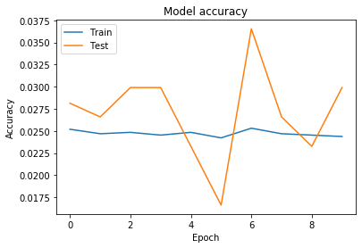
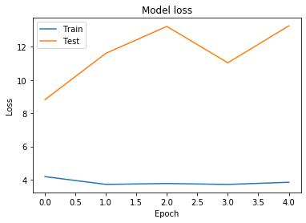
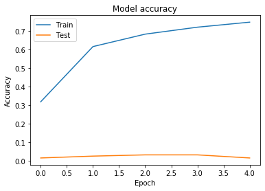
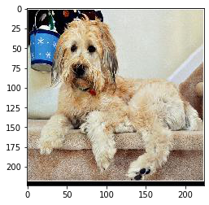

# Convolutional

## TODO:

- Инициализация начальных весов с помощью Xavier uniform initializer, установлен по умолчанию в выбранной библиотеке

- таблицы конфигураций для каждого типа

## [Введение](../README.md)

Вся проведенная работа содержится в Jupiter-ноутбуке [main.ipynb](main.ipynb). Файл включает в себя:

* Подготовку тестовых, тренировочных, валидационных данных
* Создание моделей
* Обучение моделей
* Визуализацию каждого шага
* Тестирование модели с использованием тестовых данных

## Теория

В наших моделях было использовано:

- Мы испольвали сеть ResNet50

Для использования transfer-learning последний слой был заменен на классификатор для наших данных. Который включает в себя:

- GlobalAveragePooling2D, который берет среднее по всем каналам. Это позволяет сильно уменьшить количество обучаемых параметров на классификационном Dense слое, что в свою очередь помогает бороться с переобучением

- Слой Dropout, который случайным образом отключает часть нейронов. Это позволяет предотвратить переобучение, путем тренировки некого ансамбля сетей ([arxiv](https://arxiv.org/abs/1207.0580))

- Функция активации SoftMax на выходном полносвязном слое: 

- Оптимизатор Adam - adaptive momentum ([arxiv](https://arxiv.org/abs/1412.6980v9)).  ***Learning rate=1e-2*** , установлен по умолчанию в выбранной библиотеке

#### Аугментация для наших изображений
- случайный поворот на 10 градусов
- случайное зуммирование на 10%
- случайное изменение яркости в диапозоне [0.7, 1.3]
- случайное горизонтальное отображение

## Перенос обучения

В рамках данной лабораторной работы были проведены эксперементы с следующими типами переноса обучения:

#### Первый тип переноса обучения

Берем предобученную сеть ResNet-50, заменяем последние слои для классификации на свои для последующего обучения. Всем слоям из ResNet ставим флаг trainable=False.

#### Второй тип переноса обучения

Берем предобученную сеть ResNet-50, заменяем последние слои для классификации на свои. Всем слоям из ResNet ставим флаг trainable=True, для их дообучения под нашу задачу.

#### Третий тип переноса обучения

Берем необученную сеть ResNet-50, заменяем последние слои для классификации на свои. Пытаемся обучить полученную архитектуру с нуля.

## Тестирование

Наилучшие результаты были получены для второго типа переноса обучения.

| loss   | accuracy |
|:------:|:--------:|
| 0.6234709247946739 | 0.825   |

### Пример

Запустим модель и попробуем определить породу для данного изображения 

Expected category : wheaten_terrier

| Category | without data aug |
|:--------:|:----------------:|
|wheaten_terrier    | 0.98815745 |
|havanese   |0.0051027923        |
|scottish_terrier   | 0.0036167  |
