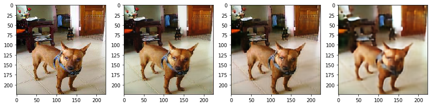
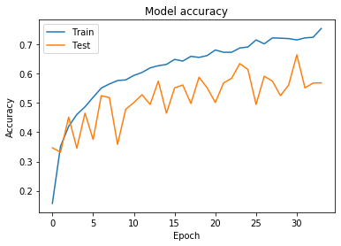
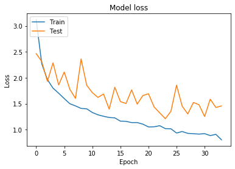
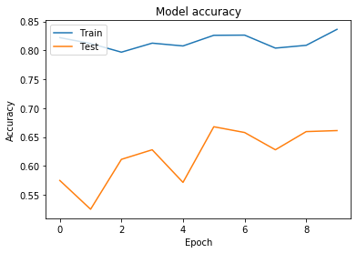
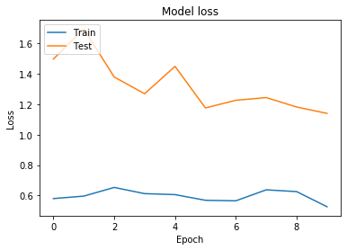
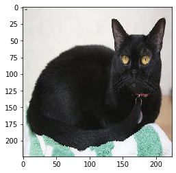

# Unsupervised-learning

## [Введение](../README.md)

Вся проведенная работа содержится в Jupiter-ноутбуке [main.ipynb](main.ipynb). Файл включает в себя:

* Подготовку тестовых, тренировочных, валидационных данных
* Создание моделей
* Обучение моделей
* Визуализацию каждого шага
* Тестирование модели с использованием тестовых данных

## Теория

В качестве алгоритма без учителя для инициализации начальных весов сети - выберем автокодировщик.
Автокодировщики применяют для предварительного обучения глубокой сети без учителя.
К каждому новому необученному слою на время обучения подключается дополнительный выходной слой, дополняющий сеть до архитектуры автокодировщика, после чего на вход сети подается набор данных для обучения. 

Веса необученного слоя и дополнительного слоя автокодировщика обучаются при помощи метода обратного распространения ошибки. 
Затем слой автокодировщика отключается и создается новый, соответствующий следующему необученному слою сети. 
На вход сети снова подается тот же набор данных, обученные первые слои сети остаются без изменений и работают в качестве входных для очередного обучаемого автокодировщика слоя. 

Так обучение продолжается для всех слоев сети за исключением последних. Последние слои сети обычно обучаются без использования автокодировщика при помощи того же метода обратного распространения ошибки и на маркированных данных (обучение с учителем).

Мы взяли архитектуру модели из второй лабораторной работы , так как она показала наилучший результат.

Конфигурация модели:

|  Layer (type)           |Output Shape    | Param #   |
|------------------------|----------------|-----------| 
|  Conv2D                 | (112, 112, 64) | 9472      |
|  batch_normalization    | (112, 112, 64) | 256       |
|  Relu                   | (112, 112, 64) | 0         |
|  max_pooling            | (56, 56, 64)   | 0         |
|  Conv2D                 | (56, 56, 128)  | 73856     |
|  batch_normalization    | (56, 56, 128)  | 512       |
|  Relu                   | (56, 56, 128)  | 0         |
|  Conv2D                 | (56, 56, 128)  | 147584    |
|  batch_normalization    | (56, 56, 128)  | 512       |
|  Relu                   | (56, 56, 128)  | 0         |
|  max_pooling            | (28, 28, 128)  | 0         |
|  Conv2D                 | (28, 28, 256)  | 295168    |
|  batch_normalization    | (28, 28, 256)  | 1024      |
|  Relu                   | (28, 28, 256)  | 0         |
|  Conv2D                 | (28, 28, 256)  | 590080    |
|  batch_normalization    | (28, 28, 256)  | 1024      |
|  Relu                   | (28, 28, 256)  | 0         |
|  max_pooling            | (14, 14, 256)  | 0         |
|  global_average_pooling | (256)          | 0         |
|  Dense                  | (37)           | 9509      |

Результаты работы модели:

|  loss   | accuracy |
|:------:|:--------:|
|  1.0759 | 0.6678   |

В нашей модели было использовано:

- GlobalAveragePooling2D, который берет среднее по всем каналам. Это позволяет сильно уменьшить количество обучаемых параметров на классификационном Dense слое, что в свою очередь помогает бороться с переобучением

- Слой Dropout, который случайным образом отключает часть нейронов. Это позволяет предотвратить переобучение, путем тренировки некого ансамбля сетей ([arxiv](https://arxiv.org/abs/1207.0580))

- Функция активации SoftMax на выходном полносвязном слое: 

- Оптимизатор Adam - adaptive momentum ([arxiv](https://arxiv.org/abs/1412.6980v9)).  ***Learning rate=1e-2*** , установлен по умолчанию в выбранной библиотеке

- Функция ошибки ***Categorical Cross-Entropy*** для классификации на несколько классов:

 

#### Аугментация для наших изображений

В данной работе была применена аугметация данных для предотвращения переобучения и стабильности модели к небольшим изменениям изображений.

- случайный поворот на 10 градусов
- случайное зуммирование на 10%
- случайное изменение яркости в диапозоне [0.7, 1.3]
- случайное горизонтальное отображение

### Автокодировщик

Для обучения автокодировщика было использовано 1/3 тренировочных и валидационых данных.

 - Слой ***Upsampling2D*** был использован для увеличения размера изображения. Используется медот ***nearest***.
 - Функция ошибки ***MSE*** для обучения автокодировщика:

 

Для построения стека автокодировщиков были использоваы следующие конфигурации:

#### Модель с первым слоем #1

|  Layer (type)           |Output Shape    | Param #   |
|------------------------|----------------|-----------|
| Conv2D (7x7x64)           | (224, 224, 64) |     9472      |
| batch_normalization | (224, 224, 64) |     256       |
| ReLU               | (224, 224, 64) |     0         |
| MaxPooling2D | (112, 112, 64) |     0         |
| Conv2D (7x7x64)                 | (112, 112, 64) |     200768    |
| batch_normalization | (112, 112, 64) |     256       |
| ReLU               | (112, 112, 64) |     0         |
| UpSampling2D | (224, 224, 64) |     0         |
| Conv2D (3x3x3)            | (224, 224, 3)  |     1731   |

Total params: 212,483

Trainable params: 212,227

Non-trainable params: 256

##### Результаты

 - Training time = 660 s (30 epochs)
 - Loss = 0.0023

#### Модель с первыми двумя слоями #2

|  Layer (type)           |Output Shape    | Param #   |
|------------------------|----------------|-----------|
| Conv2D (7x7x64)          | (224, 224, 64)    |  9472      |
| batch_normalization | (224, 224, 64)    |  256       |
| ReLU              | (224, 224, 64)    |  0         |
| MaxPooling2D | (112, 112, 64)    |  0         |
| Conv2D (3x3x128)          | (112, 112, 128)   |  73856     |
| batch_normalization | (112, 112, 128)   |  512       |
| ReLU              | (112, 112, 128)   |  0         |
| Conv2D (3x3x128)          | (112, 112, 128)   |  147584    |
| batch_normalization | (112, 112, 128)   |  512       |
| ReLU              | (112, 112, 128)   |  0         |
| MaxPooling2D | (56, 56, 128)     |  0         |
| Conv2D (3x3x128)                 | (56, 56, 128)     |  147584    |
| batch_normalization | (56, 56, 128)     |  512       |
| ReLU              | (56, 56, 128)     |  0         |
| Conv2D (3x3x128)       | (56, 56, 128)     |  147584    |
| batch_normalization | (56, 56, 128)     |  512       |
| ReLU              | (56, 56, 128)     |  0         |
| UpSampling2D | (112, 112, 128)   |  0         |
| Conv2D (7x7x64)          | (112, 112, 64)    |  401472    |
| batch_normalization | (112, 112, 64)    |  256       |
| ReLU              | (112, 112, 64)    |  0         |
| UpSampling2D | (224, 224, 64)    |  0         |
| Conv2D (3x3x3)           | (224, 224, 3)     |  1731      |

Total params: 931,843

Trainable params: 920,963

Non-trainable params: 10,880

##### Результаты

 - Training time = 1020 s (30 epochs)
 - Loss = 0.0035

#### Модель с всеми сверточными слоями слоями #3

|  Layer (type)           |Output Shape    | Param #   |
|------------------------|----------------|-----------|
| Conv2D (7x7x64)           | (224, 224, 64)   |   9472      |
| batch_normalization | (224, 224, 64)   |   256       |
| ReLU               | (224, 224, 64)   |   0         |
| MaxPooling2D | (112, 112, 64)   |   0         |
| Conv2D (3x3x128)          | (112, 112, 128)  |   73856     |
| batch_normalization | (112, 112, 128)  |   512       |
| ReLU              | (112, 112, 128)  |   0         |
| Conv2D (3x3x128)          | (112, 112, 128)  |   147584    |
| batch_normalization | (112, 112, 128)  |   512       |
| ReLU              | (112, 112, 128)  |   0         |
| MaxPooling2D | (56, 56, 128)    |   0         |
| Conv2D (3x3x256)          | (56, 56, 256)    |   295168    |
| batch_normalization | (56, 56, 256)    |   1024      |
| ReLU              | (56, 56, 256)    |   0         |
| Conv2D (3x3x256)          | (56, 56, 256)    |   590080    |
| batch_normalization | (56, 56, 256)    |   1024      |
| ReLU              | (56, 56, 256)    |   0         |
| MaxPooling2D | (28, 28, 256)    |   0         |
| Conv2D (3x3x256)                 | (28, 28, 256)    |   590080    |
| batch_normalization | (28, 28, 256)    |   1024      |
| ReLU              | (28, 28, 256)    |   0         |
| Conv2D (3x3x256)          | (28, 28, 256)    |   590080    |
| batch_normalization | (28, 28, 256)    |   1024      |
| ReLU              | (28, 28, 256)    |   0         |
| UpSampling2D | (56, 56, 256)    |   0         |
| Conv2D (3x3x128)          | (56, 56, 128)    |   295040    |
| batch_normalization | (56, 56, 128)    |   512       |
| ReLU              | (56, 56, 128)    |   0         |
| Conv2D (3x3x128)          | (56, 56, 128)    |   147584    |
| batch_normalization | (56, 56, 128)    |   512       |
| ReLU              | (56, 56, 128)    |   0         |
| UpSampling2D | (112, 112, 128)  |   0         |
| Conv2D (7x7x64)          | (112, 112, 64)   |   401472    |
| batch_normalization | (112, 112, 64)   |   256       |
| ReLU              | (112, 112, 64)   |   0         |
| UpSampling2D | (224, 224, 64)   |   0         |
| Conv2D           | (224, 224, 3)    |   1731      | 

Total params: 3,148,803

Trainable params: 2,913,923

Non-trainable params: 234,880

##### Результаты

 - Training time = 1110 s (30 epochs)
 - Loss = 0.0057

### Результаты обучения автокодировщика

Ошибка на тестовых данных составила = 0.0055

Слева направо: оригинал, [модель #1](Модель-с-первым-слоем-#1), [модель #2](#Модель-с-первыми-двумя-слоями-#2), [модель #3](#Модель-с-всеми-сверточными-слоями-слоями-#3)

Как видно автокодировщик размыл изображение и попытался выделить главные части, которые могут повлиять на дальнейшую классификацию.

### Обучение классификатора на основе автокодировщика

Уберем из модели часть декодера и вставим наш классификатор из предыдущей работы.
Обучим получившуюся модель с проинициализированными весами. При этом будем применять аугментацию данных.

Полученные результаты:

Ошибка и точность модели никак не изменились. Но изменилось колучиство эпох для достижения таких же результатов. 34 эпохи против 66 в предыдущей работе.
Попробуем так же уменьшить learnnig rate в надежде на большую сходимость к минимуму.

Опять же совершенно аналогичные результаты, за исключением количества эпох.
Получились неплохие результаты с учетом того, что время на обучение модели потребовалось в 2 раза меньше. К увеличению точности, к сожалению, это не привело.

## Тестирование

|  Loss   | Accuracy |
|:------:|:--------:|
|  1.2430409238584017 | 0.6544850508239974   |

### Пример

Запустим модель и попробуем определить породу для данного изображения 

Expected category : Bombay

| Category | Result |
|:--------:|:----------------:|
| Bombay    | 0.99999905 |
| scottish_terrier   |9.241556e-07       |
| Siamese   | 1.5148202e-09 |
